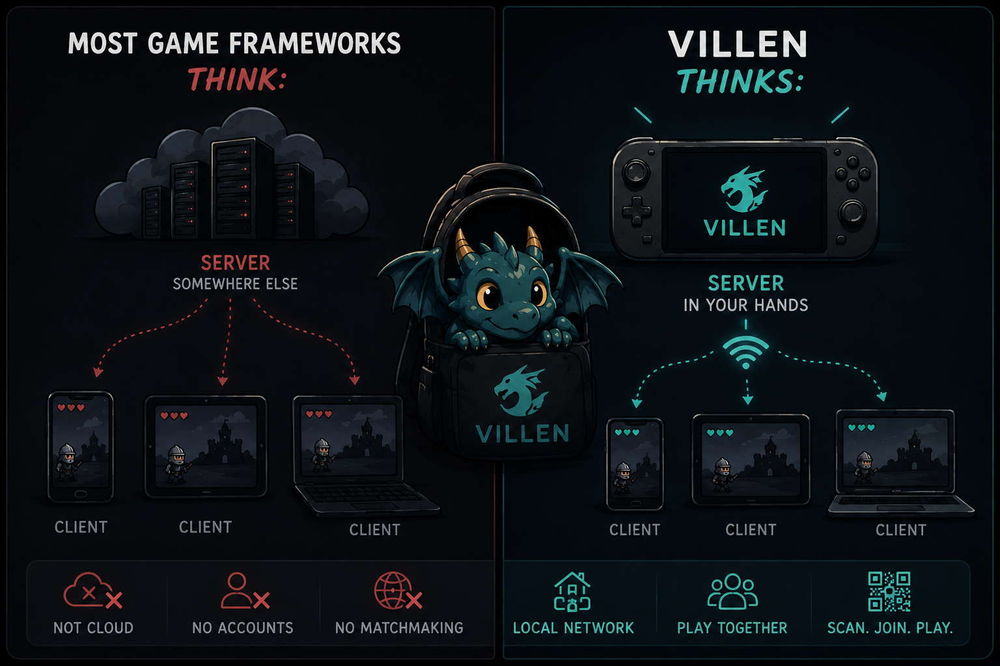
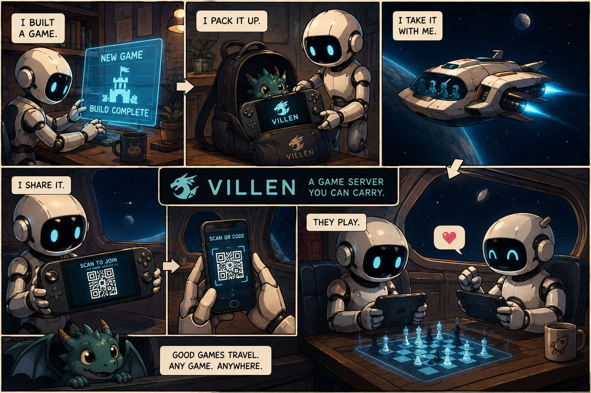

# Villen

[](https://github.com/aleozlx/villen/actions/workflows/ci.yml)
[](LICENSE)
[](docs/steamdeck-debugging.md)


A game server I carry in my packpack.

## Quick start

```bash
git clone --recursive https://github.com/aleozlx/villen
cd villen
cmake -S . -B build -G Ninja -DCMAKE_BUILD_TYPE=Release
cmake --build build
./build/host/villen --port 9002
```

Then open `http://<host-ip>:9002` from another device on the same LAN. The admin
window shows the join URL and QR code.

See [Build](#build) for dependencies, submodule notes, test commands, and
engine-only builds.

## Motivation

Run Villen on a Steam Deck or laptop, show a QR code, and nearby players join
from their phones, tablets, or browsers. The native host owns the authoritative
game state; clients only send input and render the game. No cloud, no accounts,
no matchmaking service.



The name nods to a certain dragon of fantasy lore that lives disguised as an
unremarkable traveler — fitting for a server that presents as an everyday
handheld app and is something rarer underneath. See
[`docs/DESIGN-villen.md`](docs/DESIGN-villen.md) for the full design.

Most multiplayer stacks assume the server lives somewhere else: a cloud backend,
a VPS, a desktop machine, or a home server. Villen treats the server as a
physical object you bring with you.

That makes it useful for demos, classrooms, conventions, board-game nights, LAN
parties, cafés, and creator show-and-tell: “I built this. Scan this QR code and
try it.”



Villen is not trying to be a full game engine, cloud backend, or matchmaking
service. It is the local authoritative host for small multiplayer games.

## Architecture at a glance


The host is **one C++ executable** containing, in a single thread, a pluggable
**Game Engine**, the authoritative session/seat state, a WebSocket server for
remote players, and an in-process Dear ImGui admin UI that reads and mutates
that state directly — no admin socket, no IPC. Chess is the first engine, not
the limit of the architecture.

The only network boundary is **remote players' browsers**, speaking
JSON-over-WebSocket. The admin UI *is* the server with a face — an **operator**
console, not something a game author programs against. A single 60 Hz loop pumps
the network and the UI on one thread, so there is no shared-state locking
(DESIGN §5).

> **Where this is heading:** chess is compiled *into* the host today, but the
> "engine slot" becomes a reusable **`IEngine` contract** — several engines (chess,
> snake, filter, …) implement it as modules in one binary, and a **launcher** runs one
> at a time on the Deck (each engine offers its own games/variants). Each engine
> supplies only its rules + client; Villen owns rooms,
> seats, serving, and the admin/launcher face. See
> [`docs/DESIGN-game-framework.md`](docs/DESIGN-game-framework.md).

The in-process admin UI (session/seat table, join URL + QR), reflecting a player
connected over WebSocket on the same thread:

> **[TODO]** screenshot of the in-process admin UI — the previous one went stale
> quickly; capture a fresh one from the Deck and drop it back in here.

## Engines

The slot is game-agnostic, so chess is only the first occupant. The table starts
with the **built** engines — chess (the reference spine), `filter` and `chat` now
running on the Steam Deck, plus `snake` (the real-time arena, built and CI-tested;
Deck-pad-as-seat is its one pending piece) (✅) — and descends into the **design
drafts** (📝), each chosen to stress a *different* axis of the architecture. See
[`docs/DESIGN-engine-roadmap.md`](docs/DESIGN-engine-roadmap.md) for the full
rationale, coverage matrix, and the "pick by axis, not by app" selection method.

| Engine | What it is | Axis it stresses |
|---|---|---|
| ✅ [`chess`](docs/DESIGN-villen.md) | the first engine and the reference: 2-seat turn-based board game, regular + fairy variants | the spine itself — authority, legality, turn order |
| ✅ [`filter`](docs/DESIGN-filter.md) | live camera → mathematical-morphology on the Deck's **APU** → processed frame back to the browser | streaming GPU-on-APU compute, per-connection privacy, binary transport |
| ✅ [`chat`](docs/DESIGN-chat.md) | **local LLM chat** via llama.cpp (Llama 3.1 8B / Qwen2.5 7B / Mistral 7B) | seconds-long blocking work kept off the single loop |
| ✅ [`snake`](docs/DESIGN-snake.md) | a **real-time multiplayer arena** (port of [aleozlx/snake](https://github.com/aleozlx/snake)) — kids-friendly, wrap-around, A\* AI snakes | an authoritative server clock + netcode |
| 📝 [`canvas`](docs/DESIGN-canvas.md) | a **shared collaborative drawing wall** (iPad-native) | many writers on one shared state |
| 📝 [`jam`](docs/DESIGN-jam.md) | a **clock-synced collaborative groovebox** — devices synthesize audio locally, in sync | tight cross-device shared *time* |

The Deck-side **launcher** that starts one of these at a time (plus a system-info
view) is designed in [`docs/DESIGN-admin-shell.md`](docs/DESIGN-admin-shell.md). A
forward-looking note on whether the appliance could patch its own minor bugs is in
[`docs/DESIGN-self-hotfix.md`](docs/DESIGN-self-hotfix.md).

### 🎮⚡ `chat` — measured on the actual Steam Deck APU

The `chat` engine is past paper: its local-LLM path is up on the Deck's **Van Gogh
APU via RADV Vulkan** (never software-GL `llvmpipe`), and a Step 7 throughput spike
([`spike/chat-bench/`](spike/chat-bench/)) quantifies it across all three models
(measured 2026-06-21, `llama-server` b9744, 7–8B Q4_K_M):

- 🚀 **~14–15 tok/s** single-stream decode — Qwen2.5-7B **14.4**, Llama-3.1-8B **13.7**,
  Mistral-7B **14.8** — at **sub-second TTFT** (~0.5–0.85 s). Reads faster than you do.
- 👥 **Batching scales (§8):** 4 concurrent clients reach **~27–30 tok/s aggregate**
  while each stream degrades gracefully (≈14 → 11 → 7.5 tok/s from 1 → 2 → 4 slots).
- 🧠 **Fits with room to spare (§5):** one model resident leaves **~5.7–6.9 GB** of the
  16 GB unified memory free, with the device awake and under load.
- 🐌➡️🏎️ **Vulkan ≈ 2.9× CPU:** 14.4 vs **4.96 tok/s** (`-ngl 0`) on Qwen — the APU
  offload earns its keep.
- 📈 **The `--parallel` trade-off traces a clean [Pareto curve](spike/chat-bench/README.md#concurrency-pareto-frontier)** — per-stream speed vs system throughput, with the sweet spot at 2 slots.

Full table, method, and the CPU/concurrency breakdown:
[`spike/chat-bench/README.md`](spike/chat-bench/README.md).

## Repository layout

| Path | What |
|---|---|
| `engine/` | Pure chess engine — rules only, no I/O. Unit-tested in isolation. |
| `tests/`  | doctest suite (perft + special-rule coverage). |
| `host/`   | The native binary: WS server + in-process ImGui admin UI. |
| `client/` | Browser player client (pointer **and** gamepad input adapters). |
| `docs/`   | Design & handoff docs — incl. the [game-framework contract](docs/DESIGN-game-framework.md) and the [engine roadmap](docs/DESIGN-engine-roadmap.md); architecture diagram, Steam Deck debugging guide, art brief. |
| `spike/`  | Throwaway Deck smoke-spike sources, kept as the seed for the host's diagnostics view. |

## Build

Requires a C++17 compiler, CMake ≥ 3.16, and (for the host) SDL2 + OpenGL.

The host's admin UI compiles Dear ImGui from the `third_party/imgui` git
submodule, so clone with `--recursive` (or initialise it after cloning). The
engine-only build below doesn't need it.

```bash
git clone --recursive https://github.com/aleozlx/villen
# already cloned without --recursive? initialise the submodule:
git submodule update --init third_party/imgui
```

```bash
# Debian/Ubuntu host dependencies
sudo apt-get install -y cmake ninja-build libsdl2-dev libgl1-mesa-dev zlib1g-dev

cmake -S . -B build -G Ninja -DCMAKE_BUILD_TYPE=Release
cmake --build build
ctest --test-dir build --output-on-failure
```

Engine-only (no SDL2/OpenGL needed), e.g. for CI on a headless box:

```bash
cmake -S . -B build -DVILLEN_BUILD_HOST=OFF
cmake --build build && ctest --test-dir build
```

| CMake option | Default | Effect |
|---|---|---|
| `VILLEN_BUILD_TESTS` | `ON` | Build and register the engine unit tests. |
| `VILLEN_BUILD_HOST`  | `ON` | Build the native host. Uses SDL2 + OpenGL + Dear ImGui for the admin UI; degrades to a server-only host if SDL2/OpenGL are absent. |

## Run

```bash
./build/host/villen --port 9002        # opens the admin window if a display exists
./build/host/villen --port 9002 --headless   # server only (no window)
```

Then open `http://<host-ip>:9002` in a browser (the admin window shows the URL
and a QR code). Two browsers can each claim a seat and play; on one browser you
can move with the mouse **or** a gamepad interchangeably.

| Flag | Effect |
|---|---|
| `--port N` | TCP port for the player WebSocket + HTTP client (default 9002). |
| `--headless` | Run the server loop without opening the admin window. |
| `--client-dir DIR` | Serve the browser client from `DIR` (defaults to the source tree). |
| `--engine NAME` | Boot straight into an engine (`chess`, `filter`, `chat`, `snake`) instead of the launcher. |

### Running the `chat` engine (local LLM)

The `chat` engine runs a local LLM through a managed `llama-server` child
([DESIGN-chat](docs/DESIGN-chat.md) §3.A). **Villen ships no model weights** — they
are operator-supplied by design (size + licensing, §11): nothing is downloaded
automatically. You fetch the GGUF files once and point the host at them.

```bash
# One model, spawned and managed by the host:
./build/host/villen --engine chat --headless \
  --llama-bin /path/to/llama-server \
  --model     /path/to/qwen2.5-7b-instruct-q4_k_m.gguf

# Or register several switchable models (admin console / SIGUSR1 cycles them):
./build/host/villen --engine chat \
  --llama-bin  /path/to/llama-server \
  --models-dir /path/to/ggufs
```

| Flag | Effect |
|---|---|
| `--llama-bin PATH` | Spawn & manage this `llama-server` binary (§3.A). |
| `--model PATH` | The GGUF to load at startup. |
| `--model-path id=PATH` | Register a switchable model by id; repeat per model. |
| `--models-dir DIR` | Scan a directory for `*.gguf` and auto-register recognized files. |
| `--llama-url HOST:PORT` | Talk to an already-running `llama-server` instead of spawning one. |
| `--chat-stub` | In-host echo generator — no model, no GPU (dev/CI). |

**Getting the models.** Download the Q4_K_M GGUFs from HuggingFace. A filename is
auto-recognized (for `--models-dir` and admin labelling) when it contains the model
id, e.g. `qwen2.5-7b-instruct-q4_k_m.gguf` or `Meta-Llama-3.1-8B-Instruct-Q4_K_M.gguf`:

| Model | License | GGUF source (e.g.) |
|---|---|---|
| Qwen2.5 7B Instruct | Apache-2.0 | `Qwen/Qwen2.5-7B-Instruct-GGUF` |
| Mistral 7B Instruct v0.3 | Apache-2.0 | `bartowski/Mistral-7B-Instruct-v0.3-GGUF` |
| Llama 3.1 8B Instruct | Llama 3.1 Community License | `bartowski/Meta-Llama-3.1-8B-Instruct-GGUF` |

One model is resident at a time (~5 GB each, §5); the operator switches between them
in the admin console. The `llama-server` binary is operator-supplied too. On the
Steam Deck, put the weights on the SD card and use the resume-until-complete
download loop in [`docs/steamdeck-debugging.md`](docs/steamdeck-debugging.md) §3.1
(the HuggingFace CDN drops mid-transfer), and cross-build `llama-server` per the
glibc notes there.

## License

[MIT](LICENSE) © 2026 Alex Yang
