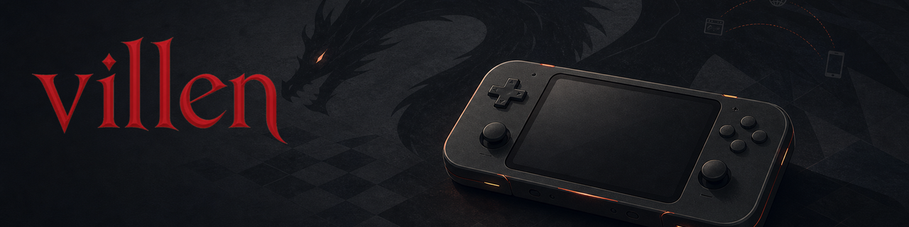
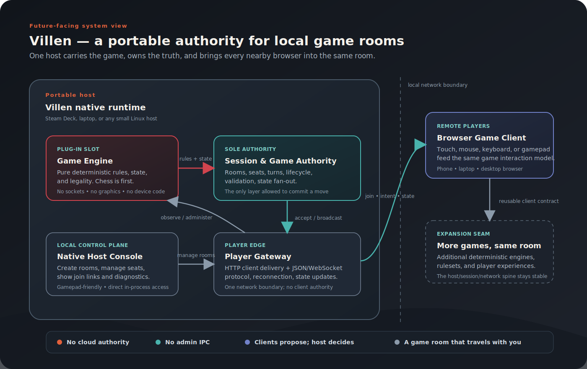
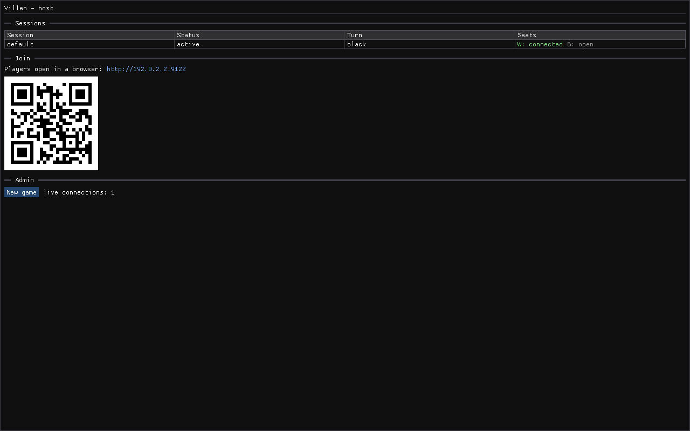

# Villen

[](https://github.com/aleozlx/villen/actions/workflows/ci.yml)
[](LICENSE)
[](docs/steamdeck-debugging.md)



> A portable **game server you carry** — a single native binary that runs the
> authoritative game, hosts the session, and serves remote players from their own
> browsers over the local network. No cloud, no accounts.

Villen is a generic host for
deterministic, turn-based, seat-based games. **Chess is the first game** built on
it — chosen because its rules engine stresses the spine (legality, end states,
turn order) without distractions. The engine is a swappable slot; the transport,
session/seat model, admin UI, and dual-input player client know nothing about
which game occupies it.

The name nods to a dragon of fantasy lore that lives disguised as an
unremarkable traveler — fitting for a server that presents as an everyday
handheld app and is something rarer underneath. See
[`docs/DESIGN-villen.md`](docs/DESIGN-villen.md) for the full design.

## Architecture at a glance



The host is **one C++ executable** containing, in a single thread, a pluggable
**Game Engine**, the authoritative session/seat state, a WebSocket server for
remote players, and an in-process Dear ImGui admin UI that reads and mutates
that state directly — no admin socket, no IPC. Chess is the first engine, not
the limit of the architecture.

The only network boundary is **remote players' browsers**, speaking
JSON-over-WebSocket. The admin UI *is* the server with a face — an **operator**
console, not something a game author programs against. A single 60 Hz loop pumps
the network and the UI on one thread, so there is no shared-state locking
(DESIGN §5).

> **Where this is heading:** chess is compiled *into* the host today, but the
> "engine slot" inverts — Villen becomes a **library a single game depends on**.
> A future game (Snake, a card game, …) carries Villen as a submodule for rooms,
> seats, and serving, and supplies only the rules + client against a small
> `IGame` contract; one game type per binary, no IPC. See
> [`docs/DESIGN-game-framework.md`](docs/DESIGN-game-framework.md).

The in-process admin UI (session/seat table, join URL + QR), reflecting a player
connected over WebSocket on the same thread:



## Repository layout

| Path | What |
|---|---|
| `engine/` | Pure chess engine — rules only, no I/O. Unit-tested in isolation. |
| `tests/`  | doctest suite (perft + special-rule coverage). |
| `host/`   | The native binary: WS server + in-process ImGui admin UI. |
| `client/` | Browser player client (pointer **and** gamepad input adapters). |
| `docs/`   | Design & handoff doc, [game-framework contract](docs/DESIGN-game-framework.md), architecture diagram, Steam Deck debugging guide, art brief. |
| `spike/`  | Throwaway Deck smoke-spike sources, kept as the seed for Step 7's diagnostics window. |

## Build

Requires a C++17 compiler, CMake ≥ 3.16, and (for the host) SDL2 + OpenGL.

The host's admin UI compiles Dear ImGui from the `third_party/imgui` git
submodule, so clone with `--recursive` (or initialise it after cloning). The
engine-only build below doesn't need it.

```bash
git clone --recursive https://github.com/aleozlx/villen
# already cloned without --recursive? initialise the submodule:
git submodule update --init third_party/imgui
```

```bash
# Debian/Ubuntu host dependencies
sudo apt-get install -y cmake ninja-build libsdl2-dev libgl1-mesa-dev zlib1g-dev

cmake -S . -B build -G Ninja -DCMAKE_BUILD_TYPE=Release
cmake --build build
ctest --test-dir build --output-on-failure
```

Engine-only (no SDL2/OpenGL needed), e.g. for CI on a headless box:

```bash
cmake -S . -B build -DVILLEN_BUILD_HOST=OFF
cmake --build build && ctest --test-dir build
```

| CMake option | Default | Effect |
|---|---|---|
| `VILLEN_BUILD_TESTS` | `ON` | Build and register the engine unit tests. |
| `VILLEN_BUILD_HOST`  | `ON` | Build the native host. Uses SDL2 + OpenGL + Dear ImGui for the admin UI; degrades to a server-only host if SDL2/OpenGL are absent. |

## Run

```bash
./build/host/villen --port 9002        # opens the admin window if a display exists
./build/host/villen --port 9002 --headless   # server only (no window)
```

Then open `http://<host-ip>:9002` in a browser (the admin window shows the URL
and a QR code). Two browsers can each claim a seat and play; on one browser you
can move with the mouse **or** a gamepad interchangeably.

| Flag | Effect |
|---|---|
| `--port N` | TCP port for the player WebSocket + HTTP client (default 9002). |
| `--headless` | Run the server loop without opening the admin window. |
| `--client-dir DIR` | Serve the browser client from `DIR` (defaults to the source tree). |

## License

[MIT](LICENSE) © 2026 Alex Yang
