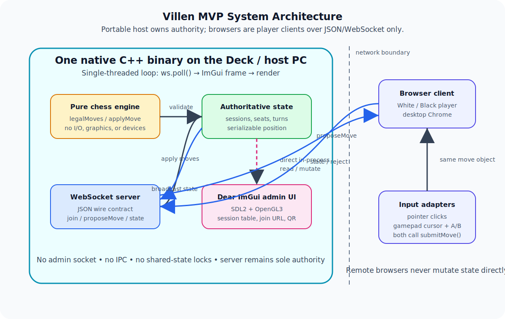

# Villen — MVP Design & Handoff

> **Villen** — a portable chess(-variant) server you carry. The name nods to a dragon of fantasy lore that lives disguised as an unremarkable traveler — fitting for a server that presents as an ordinary handheld app and is something rarer underneath. The project began with the question "is that a dragon on the chessboard?" (The chess-dragon = bishop+knight compound, an *archbishop*.) Bonus reading: *Villen* is German for "villas" — a host that holds rooms players join.

**Status:** Ready for implementation
**Scope:** Minimum slice that proves the architecture. Vanilla chess, desktop Chrome player client, no AI.
**Audience:** The engineer standing this up. Assumes C++ familiarity (CMake, an event loop, basic graphics-backend boilerplate). No prior context on this project assumed.

> **The architecture is not chess-specific.** Villen is a *generic host for deterministic, turn-based, seat-based games* — a portable session server with an in-process admin UI and a browser player client. Chess is the **first game we are building** on it, chosen because it is a well-understood, fully-deterministic rules engine that stresses the spine (legality, end states, turn order) without distractions. Everywhere this document says "chess," read "the pluggable game engine, of which chess is the first instance." The engine is a swappable slot (§9.1); the transport, session/seat model, admin UI, and dual-input client know nothing about which game occupies it.

---

## 1. Context & one-paragraph pitch

We are building **Villen**, a chess (later: chess-variant) system where **a single machine — eventually a Steam Deck you physically carry — runs the authoritative game server, the session-management UI, and accepts remote players from their own browsers over the local network.** The long-term vision is a portable "arcade cabinet in a backpack": power on the Deck, it boots into a native app like any Steam title, people scan/enter an address and play from their phones or laptops, no cloud and no accounts. This document specifies the **MVP**, which strips everything except the load-bearing spine so we can prove that spine stands up end to end.

The MVP is *not* about chess. Chess is a stand-in for "some deterministic turn-based game engine." The MVP proves that **a move made in a remote browser reaches an authoritative engine on the host and the resulting state comes back**, that the host renders/manages sessions natively on the Deck, and that the client's input layer is general enough to survive the features we are deferring.

---

## 2. The host is a single native C++ binary

This is the central architectural fact and it drives everything else.

The host is **one C++ executable** containing, in one process:

- the **engine** (pure chess rules),
- the **authoritative session/seat state** (in memory),
- a **WebSocket server** that remote player browsers connect to, and
- an **in-process Dear ImGui admin UI** (SDL2 + OpenGL3 backend) that reads and mutates that state **directly** — no socket, no IPC, no separate admin client.

The only thing that crosses a network boundary is **remote players' browsers**, which speak the JSON-over-WebSocket contract in §6. The admin UI is not a client of anything; it *is* the server, with a face. "It's like one of the games" — to SteamOS it is just a native windowed app that Gamescope composites, launched in Game Mode as a (non-Steam) shortcut.

```
ONE NATIVE BINARY (on the Deck)
├─ engine                       pure rules; no I/O
├─ session / seat state         in-memory, authoritative
├─ WS server  ◄───────────────  remote player browsers  (the ONLY sockets)
└─ ImGui loop  ──reads/mutates──►  session state directly  (NO socket)
        (SDL2 + GL3 backend; gamepad-navigable)
```



---

## 3. Goals (what the MVP must prove)

1. **The engine slot works.** A pure, deterministic chess engine — `applyMove` / `legalMoves` / serializable state — with zero knowledge of network, graphics, or input device.
2. **The server is authoritative.** The host process owns game state, validates every move against the engine, and rejects illegal ones. Remote clients never hold authority.
3. **The transport spine works.** A remote browser sends a move over WebSocket; the server applies it and broadcasts new state; all connected player clients re-render.
4. **The input-adapter abstraction is real, not theoretical.** The browser player client supports **two mechanically different input sources** — pointer (click squares) and gamepad (cursor + button) — and both emit the *same* move into a *single* intake. This is the most architecturally important acceptance criterion; see §7.
5. **The host manages sessions natively.** The in-process Dear ImGui UI lists active sessions/seats and shows the join instructions (address + code + QR) that remote players use to connect. It is navigable with the Deck's own controls.

---

## 4. Non-goals (explicitly out of MVP scope)

Deferred. Listed so the implementer **does not accidentally foreclose them** (see §9 for the structures that protect them).

- Deck-local physical input *routing into a game seat* (the Deck's thumbstick driving White). MVP gameplay input is browser-only; the Deck's controls in the MVP drive only the admin UI.
- Fairy pieces / custom piece definitions. MVP is standard chess.
- AI opponent.
- Mobile/touch player client; QR-first walk-up as the primary path. MVP player client targets **desktop Chrome**; admin shows a QR but typing the address is acceptable.
- Reconnection / session-resume polish; automated seat lifecycle.
- HTTPS, PWA, SoftAP hotspot, Tailscale, P2P/WebRTC, cloud deployment.

---

## 5. Concurrency model — READ THIS (the one thing easy to get wrong)

Two things touch session state: **WS network callbacks** (a player moved) and the **ImGui frame loop** (drawing the session table, issuing admin actions). The MVP mandates a **single-threaded, single-loop design with no shared-state locking:**

```cpp
while (running) {
    ws.poll();            // drain network events -> mutate session state
    beginImGuiFrame();
    drawAdminUI();        // reads + mutates the SAME state, same thread
    render();             // SDL2 / GL3 present
}                         // ~60 fps; chess move latency is irrelevant
```

Because the network handlers and the UI run on **one thread**, there is **no concurrent access: no mutex, no data race, no cross-thread lifetime puzzle.** A chess server's throughput makes a 60 Hz poll trivially sufficient. Do **not** reach for worker threads + shared mutable state; nothing here blocks. If a future feature genuinely blocks, introduce exactly one guarded queue at that point — never ambient shared state across threads.

(Rationale: we chose C++ over Rust deliberately — see §11. The price of declining Rust's compile-time concurrency guarantees is paid back here by choosing an architecture that doesn't need them.)

---

## 6. Wire contracts (the network boundary — players only)

These govern the **remote-browser ↔ server** edge. The ImGui admin sits on the *in-process* side and does not use these. JSON over WebSocket; every message has a `type`.

### 6.1 Client → Server

```jsonc
// Claim a seat in a session.
{ "type": "join", "session": "default", "seat": "white" }   // seat optional; server may assign

// Propose a move. Server validates against engine; may reject.
{ "type": "proposeMove", "session": "default", "seat": "white",
  "move": { "from": "e2", "to": "e4", "promotion": null } }

{ "type": "ping" }                                          // optional liveness
```

### 6.2 Server → Client

```jsonc
// Full authoritative state after any change. Clients render from this.
{ "type": "state",
  "session": "default",
  "position": "<FEN-or-equivalent serializable string>",
  "turn": "white",
  "legalMoves": [ { "from": "e2", "to": "e4" }, ... ],   // for the seat to move (UX only)
  "status": "active",                                     // active | checkmate | stalemate | draw
  "seats": { "white": "connected", "black": "disconnected" } }   // connected | disconnected | open

{ "type": "reject", "reason": "illegal_move", "move": { "from": "e2", "to": "e5" } }
// reason ∈ { illegal_move, not_your_turn, seat_disconnected, bad_message, unknown_type }

{ "type": "sessionUpdate", "seats": { "white": "connected", "black": "open" } }
```

**Contract rules:**

- Server sends **full state** (`position`), not deltas, in the MVP. Idempotent, no reconciliation. Optimize later only if needed.
- `move` is plain data, **not** tied to how it was produced. A pointer click and a gamepad confirm produce the identical object — this is what makes input adapters interchangeable.
- `legalMoves` is a client-side UX convenience (highlighting). The **server is still the sole authority**; client-side legality is never trusted.
- `move` is attributed to a **seat**, not a connection. When input sources later decouple from connections (deferred Deck-input routing, reconnection, spectators), the contract does not change.
- A **seat outlives its connection** (§9.3, §13 #1). A seat is `connected`, `open`, or `disconnected` (held across a drop). A held seat is reserved: no one — not even the opponent — may move that side, and proposing one is rejected with `seat_disconnected`. Reconnect is token-free: an explicit `join` for a seat *by name* reclaims a held seat; auto-assign (no `seat`) only takes `open` seats. The host can also re-open any seat from the admin UI.

---

## 7. The dual-adapter requirement (acceptance-critical)

The single most informative thing the MVP proves, on the **browser player client**. Two adapters, mechanically different, one intake:

- **Pointer adapter:** click source square, click destination → emit `{from, to}`.
- **Gamepad adapter:** D-pad/stick moves a highlighted cursor square-to-square; **A** selects piece then destination; **B** cancels. Emits the identical `{from, to}`.

Both call the *same* client function (e.g. `submitMove(move)`), which wraps it in a `proposeMove` message. **Neither adapter knows the other exists; the intake does not know which produced the move.** In the MVP both are live simultaneously on the same desktop-Chrome client — use whichever; no binding UI. This simplifies the MVP *and* exercises the source-agnostic seam every deferred feature relies on.

**Acceptance test:** play a full game alternating mouse and gamepad on one client; server accepts all legal moves and rejects a deliberately illegal one, behaving identically regardless of which adapter produced each move.

*(Note: this gamepad path is in the browser player client, via the Gamepad API. It is unrelated to the Deck's native controls driving the ImGui admin UI — different layer, different code.)*

---

## 8. Recommended C++ library stack

Concrete picks so the implementer isn't choosing under ambiguity. All via CMake + FetchContent/submodules. Output: one binary.

| Concern | Pick | Notes |
|---|---|---|
| WebSocket server | **uWebSockets (µWS)** | Fast, event-loop oriented, pumps cleanly from the main loop (§5). Alt: websocketpp + Asio for a more conventional model. |
| JSON | **nlohmann/json** | Ergonomic; ample at LAN/chess message volume. Swap to glaze/simdjson only if ever needed (won't be). |
| UI | **Dear ImGui** | Immediate-mode; a session table + QR + buttons is its home turf. |
| UI backend | **SDL2 + OpenGL3** | Copy upstream `examples/example_sdl2_opengl3/main.cpp`. SDL2 also gives native Deck gamepad input for admin navigation. |
| Gamepad nav (admin) | ImGui `NavEnableGamepad` | D-pad through the session list, A to act — works out of the box. |
| QR | any small C/C++ QR lib (e.g. qrcodegen) | Render the join URL in the admin panel. |

GL/Vulkan enters only as ImGui-backend boilerplate you copy from the example — you author `ImGui::BeginTable(...)`, not graphics code.

**Dependency mechanism (decided).** Dear ImGui enters as a **git submodule** at `third_party/imgui`, pinned to a release tag; the host target compiles its core `.cpp` plus the `imgui_impl_sdl2` / `imgui_impl_opengl3` backends directly. Submodule over vendoring/FetchContent because the Deck never builds (the host is cross-compiled on PC and copied over, §11.1), so the only cost is a one-time `git submodule update --init` in exchange for an exact, automatic version pin. nlohmann/json stays **vendored** as its single header (`third_party/nlohmann/`); SDL2 + OpenGL come from the system via `find_package`.

---

## 9. Structures that protect the deferred features

Cheap now, painful to retrofit. Preserve even though the MVP doesn't exercise them:

1. **Engine is pure** — no graphics, no socket, no device code. Lets fairy pieces drop in as data later, and lets the engine validate authoritatively forever.
2. **State is serializable and self-contained** (FEN-like). Buys save/load, spectating, replay, reconnection almost for free.
3. **Moves are attributed to a seat, not a connection.** The hinge for routing Deck input into any seat, reconnection (new connection, same seat), and spectators (a connection viewing a seat it doesn't drive).
4. **Privilege is structural, not networked.** Admin is privileged because it is *in-process*, not because of any credential. There is no admin socket to secure. Remote = player, in-process = admin. Clean by construction.
5. **The WS contract governs only the player network edge.** Keep all network concerns on that boundary; never let ImGui or engine code reach into socket details.

---

## 10. MVP acceptance criteria (definition of done)

1. One binary builds and runs on a dev machine (Deck-equivalent Linux); it opens an ImGui window and listens for WS connections.
2. Two desktop-Chrome browsers on the LAN connect via the address shown in the admin UI and each claim a seat (White / Black).
3. A legal move from one browser is validated server-side, applied, and both browsers re-render the new position within one broadcast.
4. An illegal move (or out-of-turn move) is rejected with a `reject` message; no client can force an illegal state.
5. On a single browser client, moves can be made by **both** mouse and gamepad interchangeably (§7 test passes).
6. The ImGui admin UI lists the active session with both seats' connection status and shows the join URL as text **and** QR; it is navigable with a gamepad / the Deck's controls.
7. Checkmate/stalemate are detected by the engine and reflected in `status`.

---

## 11. Build order (smallest-spine-first)

1. **Engine, standalone.** Pure C++ chess module + unit tests (legality, end states). No server, no UI.
2. **µWS server in a bare main loop.** Accept `proposeMove`, call the engine, broadcast `state`. One hardcoded session. Test with a CLI WS client or a throwaway browser snippet.
3. **Browser player client, pointer-only.** Render from `state`, click-to-move, observe broadcasts. Proves the loop with one input source.
4. **Add the gamepad adapter** (browser, Gamepad API) into the same `submitMove`. **Architectural milestone — §7.**
5. **Seats + two browsers.** White/Black, turn enforcement, rejection path.
6. **Deck smoke spike (throwaway).** *On the actual Deck, in Game Mode.* A ~50-line SDL2+GL3+ImGui window — a dummy "sessions" table and one gamepad-navigable button — launched as a non-Steam shortcut, driven by the Deck's own D-pad/buttons. In the same sitting, confirm a phone/laptop on the same WiFi can reach the server (from steps 2–5) running on the Deck. **Purpose: retire all Deck-specific risk (§11.1) while the UI code is still disposable.** Do this the moment the server can bind a port — *before* building the real admin UI.
7. **ImGui admin shell.** Add SDL2+GL3 + Dear ImGui to the *same binary*; pump `ws.poll()` and the ImGui frame in one loop (§5). Draw the session/seat table, join URL, QR. Gamepad-navigable. Proceeds with confidence because step 6 already proved the Deck path.

Steps 1–3 prove the spine; step 4 proves the abstraction; step 6 retires Deck risk; steps 5 & 7 make it demonstrable on the Deck.

### 11.1 Where to build, and the Deck-specific risk surface

**Build on PC; deploy to Deck is a recompile-and-copy.** The engine, µWS server, WS contract, browser client, and single-threaded loop are **identical on a PC and a Deck** (both x86-64 glibc Linux) — there is nothing to "port" for ~90% of the system, and PC iteration (real keyboard, debugger, monitor) is strictly faster. Develop steps 1–5 and 7 entirely on PC.

**Recompile-and-copy has one glibc caveat (learned in the step-6 spike).** The copy only works if the *build* glibc is no newer than the Deck's. A bleeding-edge distro (glibc 2.43) binds new symbol versions the Deck's glibc (2.41) does not export, so the binary aborts in the dynamic loader *before* `main()` — it presents as an instant crash with no output. Mitigations, cheapest first: statically link the C++ runtime (`-static-libstdc++ -static-libgcc`); pin any too-new libc symbols back to an older node with a force-included `.symver` shim (the spike needed it for `sqrtf`/`acosf`/`atan2f`, all bumped to `@GLIBC_2.43`); or, most robust, build in a container whose glibc ≤ the Deck's. Sanity-check with `objdump -T <bin> | grep GLIBC_` before copying. (The Deck has no compiler/CMake and a read-only rootfs, so building *on* it is not an option — cross-build is mandatory, not just preferred.)

The **only** parts that can behave differently on the Deck are the four items below. They are all retired by the step-6 spike, done early *because* they are the highest-uncertainty, highest-blast-radius risks — a surprise here can force a redesign, so hit it against throwaway code, not the finished admin UI.

| # | Deck-specific risk | What to verify in the spike |
|---|---|---|
| 1 | **Game Mode / Gamescope compositing** | The SDL2+GL3 window comes up as a non-Steam shortcut, full-screen, focused, under Gamescope. |
| 2 | **Gamepad input via Steam Input** | The Deck's D-pad/buttons reach SDL2 in Game Mode. **Likely fix:** set the shortcut's controller config to a no-remap / "Gamepad" template — Steam Input otherwise sits between hardware and SDL2 and may eat or remap inputs. Learn this on the spike, not while debugging the finished UI. |
| 3 | **LAN reachability** | A phone/laptop on the same WiFi can hit the Deck's IP:port. Watch for AP **client isolation** on shared/public networks (silently blocks device-to-device). A network property, not a code bug. |
| 4 | **GL context under Gamescope** | The GL3 context initializes cleanly with the Deck's driver. Usually fine; verify rather than assume. |

None of these touch engine/server/contract/client logic — that code is machine-agnostic. The risk is confined to windowing, input routing, and the network environment, which is exactly why one small native spike clears it.

---

## 12. Rejected alternatives (why the stack is what it is)

- **Bun / JS server (earlier draft).** Was attractive for "same server code on Deck *and* on a Cloudflare Durable Object" cloud-parity. **Rejected** once the admin UI became native in-process Dear ImGui: a JS server cannot share in-process memory with a C++ ImGui loop, which would force an admin socket/IPC and re-introduce the very client/server split the in-process design removes. Going native C++ end-to-end keeps one process, one toolchain, one binary. **Trade accepted:** we lose trivial cloud-DO portability of the server. Acceptable because "carry the Deck *as* the server" is the actual thesis; cloud fallback was always a deferred nicety.
- **Webview shell (Tauri/wry) for admin.** Keeps the admin UI as web markup in a native window. **Rejected** as overkill: the admin is a dense control panel, not a styled web page, and a webview drags in a runtime and manual gamepad→DOM focus bridging. ImGui gives native gamepad nav and a single dependency-light binary.
- **Rust (egui / imgui-rs).** Would give compile-time concurrency safety. **Rejected** for this single-author project given existing C++/Dear ImGui fluency and binding friction; the concurrency safety it offers is instead obtained structurally via the single-threaded loop (§5).
- **Pure C (cimgui + libwebsockets + cJSON).** Dear ImGui's API is C++ (namespaces, overloads, `ImVector<>`); `cimgui` provides a maintained C99 binding, so C *application code* is possible. **Rejected** because (a) cimgui still compiles the C++ ImGui core + backends and links libstdc++ — the binary is never truly C-free as long as ImGui is present; and (b) it would force C ports of the other two pillars (µWS→libwebsockets, nlohmann→cJSON), both with more manual/thornier APIs, for purity that's already compromised at the link step. Instead we write a disciplined C++ *subset* ("C with destructors"): flat, allocation-visible code plus RAII for socket/GL/handle cleanup and `std::` containers for buffers — ~95% of C's no-magic feel while keeping upstream ImGui, µWS, and nlohmann ergonomics. A Steam Deck (full glibc+libstdc++) imposes no constraint that would justify pure C.
- **Raw OpenGL/Vulkan admin UI.** Never considered seriously — writing a UI toolkit to draw a table. ImGui's backend boilerplate is the only GL we touch.
- **Deltas instead of full-state broadcast.** Premature optimization at chess message volume; full-state is idempotent and simpler.

---

## 13. Open questions to revisit *after* MVP (do not block)

- Reconnection: host re-issues seat access ("pull up sessions in the admin UI, player rescans") rather than clients holding bearer tokens. Decided in principle; deferred in build. Enabled by seat≠connection (§9.3). **Implemented (first post-MVP increment).** A dropped seat is *held* (`disconnected`) rather than vacated, so the opponent can't seize it; a held side rejects moves with `seat_disconnected`. Two token-free ways back in: a player rejoins by re-asking for their seat *by name* (the seat name is public routing, not a credential — a transient browser drop reclaims automatically; a full page refresh loses the remembered seat and falls back to the admin path), or the host re-opens the seat from the admin UI's per-seat "Free" control. Still deferred: seat *lifecycle automation* (timeouts that auto-free a long-dead seat) and multi-session management.
- Routing the **Deck's native controls into a game seat** — the admin UI already reads the gamepad in the MVP, which is the seed of this plumbing.
- Connectivity beyond same-LAN: SoftAP for infra-free play; Tailscale for remote.
- Display-only clients (a borrowed screen mirroring a seat) collapse into the uniform browser client: one that renders a seat it isn't the bound source for. No new type needed.
- Fairy pieces / custom piece definitions as engine data; AI via an engine that consumes the same serializable state.
- 
