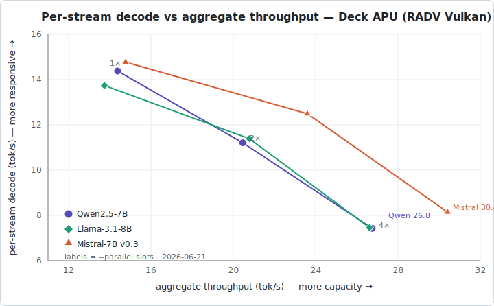

# Chat engine Step 7 — Deck APU/Vulkan throughput spike

A pure-stdlib Python benchmark that **quantifies** local LLM inference on the Steam
Deck's Van Gogh APU, for [`DESIGN-chat.md`](../../docs/DESIGN-chat.md) §14 **step 7**
(acceptance criterion #6: *"on the Deck, `llama-server` reports Vulkan/`radeonsi`,
one model fits in memory with Gamescope running, and tok/s is recorded"*).

**Step 4 proved the path** — Qwen2.5-7B streams via RADV Vulkan on the APU. **Step 7
measures it:**

1. **tok/s (decode) & TTFT (time-to-first-token)** per model — the numbers a user feels.
2. **Vulkan vs CPU** — an `-ngl` sweep (`99` = offload all layers, `0` = pure CPU).
3. **Unified-memory headroom** — `MemAvailable` while a model is resident, the §5
   "does one model fit alongside SteamOS + Gamescope?" budget.
4. **`--parallel` multi-client concurrency** — continuous batching across N slots (§8):
   per-stream vs aggregate system throughput as slots increase.

It is **throwaway** in spirit (a §11.1-style risk burn-down), but kept like
[`../deck/`](../deck/) is — as the **recorded throughput baseline** and the seed for
the admin console's **Live stats** panel (tok/s, queue depth — §9).

> **Status: RECORDED on the Deck, 2026-06-21** (see [Results](#results--recorded-2026-06-21-on-the-deck)
> below). Harness verified LLM-free on a PC first (spawn + attach paths,
> `vulkan`/`cpu`/`llvmpipe` classification, concurrency, memory sampling, the report),
> then run on the actual Van Gogh APU. **Headline: all three 7–8B Q4 models stream at
> ~14–15 tok/s single-stream on RADV Vulkan (sub-second TTFT), 4-client batching
> reaches ~27–30 tok/s aggregate, one model resident leaves ~5.7–6.9 GB free, and
> Vulkan is ~2.9× faster than CPU** (`-ngl 0`). Backend read **vulkan** (RADV VANGOGH)
> in every cell — never `llvmpipe`. (Step 4 had estimated ~9–11 tok/s; the full sweep
> measures it higher and across all three models.)

## Results — recorded 2026-06-21 on the Deck

Hardware: Steam Deck (Van Gogh APU, **AMD Custom GPU 0405 / RADV VANGOGH**, 16 GB
unified, 9216 MiB GPU-visible heap), SteamOS, `llama-server` build **b9744**, served
while a desktop session + a looping video held the device awake (a realistic
co-tenant). `-c 4096`, `ignore_eos`, `cache_prompt:false`. Every cell's server log
showed the RADV VANGOGH device; **none** showed `llvmpipe`.

**Vulkan (`-ngl 99`), 128 tokens × 3 reps:**

| model | par | backend | TTFT s | decode tok/s | agg tok/s | prompt tok/s | min avail GB | RSS GB | load s |
|---|--:|---|--:|--:|--:|--:|--:|--:|--:|
| Qwen2.5-7B Q4_K_M | 1 | vulkan | 0.75 | **14.38** | — | 57.9 | 5.71 | 0.40 | 6.0 |
| Qwen2.5-7B Q4_K_M | 2 | vulkan | 1.10 | 11.21 | 20.46 | 39.0 | 5.58 | 0.39 | 5.0 |
| Qwen2.5-7B Q4_K_M | 4 | vulkan | 1.91 | 7.43 | **26.75** | 22.3 | 5.63 | 0.40 | 5.0 |
| Llama-3.1-8B Q4_K_M | 1 | vulkan | 0.84 | **13.74** | — | 58.8 | 5.78 | 0.43 | 67.1 |
| Llama-3.1-8B Q4_K_M | 2 | vulkan | 1.08 | 11.39 | 20.78 | 45.7 | 5.78 | 0.37 | 6.0 |
| Llama-3.1-8B Q4_K_M | 4 | vulkan | 2.08 | 7.46 | **26.62** | 23.5 | 6.07 | 0.38 | 5.0 |
| Mistral-7B v0.3 Q4_K_M | 1 | vulkan | 0.48 | **14.77** | — | 41.6 | 6.85 | 0.16 | 60.1 |
| Mistral-7B v0.3 Q4_K_M | 2 | vulkan | 0.60 | 12.49 | 23.60 | 33.0 | 6.79 | 0.12 | 20.0 |
| Mistral-7B v0.3 Q4_K_M | 4 | vulkan | 1.12 | 8.15 | **30.41** | 17.3 | 6.67 | 0.14 | 4.0 |

**CPU baseline (`-ngl 0`), Qwen2.5-7B, 96 tokens × 2 reps:**

| model | par | backend | TTFT s | decode tok/s | prompt tok/s | min avail GB | RSS GB | load s |
|---|--:|---|--:|--:|--:|--:|--:|--:|
| Qwen2.5-7B Q4_K_M | 1 | cpu | 3.51 | **4.96** | 12.0 | 10.28 | 4.66 | 61.1 |

What the numbers say:

- **Single-stream ~14–15 tok/s, sub-second TTFT** on all three models — comfortably
  faster than reading speed, so the chat feels live.
- **Vulkan ≈ 2.9× CPU** (Qwen 14.38 vs 4.96 tok/s) and TTFT 0.75 s vs 3.51 s — the APU
  offload clearly earns its keep; software/CPU fallback would be a degraded experience,
  not a broken one.
- **Continuous batching (§8) scales:** per-stream decode degrades gracefully
  (≈14 → 11 → 7.5 tok/s from 1 → 2 → 4 slots) while *aggregate* system throughput
  climbs to **~27–30 tok/s** at 4 concurrent clients (~1.9–2× the single-stream rate).
  So a handful of simultaneous players is fine; size the host's `--parallel` to taste.
- **One model fits with room to spare (§5):** a resident 7–8B Q4 leaves **~5.7–6.9 GB**
  of the 16 GB free with the device under load — never close to exhaustion.
- **RSS quirk worth knowing:** on Vulkan the server's *process* RSS is tiny
  (0.12–0.43 GB) because the weights live in GPU-visible unified memory, not process
  RAM; the real ~4–4.5 GB footprint shows up in the **`MemAvailable` drop**, not RSS.
  CPU mode (`-ngl 0`) keeps weights in process RAM → RSS 4.66 GB. Read `min avail GB`,
  not `RSS GB`, for the unified-memory budget.

Raw per-stream JSON and the auto-generated tables live in `results-vulkan.{json,md}` /
`results-cpu.{json,md}` (git-ignored); the per-cell server logs (with the RADV device
banner) are under `bench-logs/`.

### Concurrency Pareto frontier



The `--parallel` slot count is a dial on a **Pareto frontier** between single-user
responsiveness (per-stream decode, y) and system capacity (aggregate throughput, x) —
both "up = good", so the curve slopes *down* to the right. Each point is non-dominated:
par=1 is the most responsive, par=4 the highest capacity, par=2 in between.

Read the shape, not just the slope: the curves stay high through **2 slots** then fall
off faster toward 4 — i.e. the *first* slot of concurrency is nearly free (1→2 barely
dents per-stream speed) while 2→4 costs more and roughly doubles TTFT again. So **2 is
the sweet spot** for a Deck serving a few friends; 4 only under sustained simultaneous
load. Mistral's curve sits above-and-right of the other two (Pareto-dominant on
*throughput* here — a separate question from output quality, which this spike doesn't
measure).

> Note on orientation: the textbook "knee" is usually drawn as *latency vs throughput*
> and bends **up** (latency explodes near saturation). This is the same data with
> per-stream **speed** (≈ 1/latency) on y, which mirrors it top-to-bottom — plot TTFT on
> y instead and you'd get the familiar upward knee (0.75 → 1.1 → 1.9 s).

## Why benchmark `llama-server` directly

The host is a thin **non-blocking proxy** (`LlamaClient` pumps bytes; `LlamaProcess`
spawns the child — `host/src/llama_process.cpp`) and adds negligible overhead. The
thing under test is the **APU**, so this driver spawns `llama-server` with the host's
*exact* argv (`-ngl 99 --parallel N`, the OpenAI `/v1/chat/completions` streaming
path) and measures the server. The numbers are faithful to what `--engine chat` does.

Decode throughput and TTFT come from llama-server's own `timings` block
(`predicted_per_second`, `prompt_per_second`) — server-authoritative — cross-checked
against client-side wall-clock. `ignore_eos` + `cache_prompt:false` make every
request do a real prompt eval and emit exactly `--max-tokens` tokens, so cells are
comparable.

## Files

- `bench.py` — the driver (pure stdlib: urllib / threading / subprocess / json).
- `fake_llama_server.py` — an LLM-free, GPU-free stub that mimics llama-server's
  `/health` + streaming `/v1/chat/completions` (with `timings`). Lets you verify the
  whole harness on a PC before it touches the Deck — the project's "CI stays
  LLM-free" discipline (§13). It is **not** a model and reports nothing real.
- `bench-logs/`, `results-*.json`, `results-*.md` — run output (git-ignored).

## Verify on a PC first (no model, no GPU)

```bash
./bench.py --llama-bin ./fake_llama_server.py --model /dev/null \
           --ngl 99,0 --parallel 1,2 --max-tokens 16 --reps 2
```

A healthy self-test classifies `backend: vulkan` for `-ngl 99` and `backend: cpu`
for `-ngl 0`, fires 2 concurrent streams for `--parallel 2`, samples memory, and
writes `results-*.{json,md}`. (The stub's tok/s are meaningless — only the harness
mechanics are under test here.)

## Run on the Deck

Prereqs on the Deck (see [`../../docs/steamdeck-debugging.md`](../../docs/steamdeck-debugging.md)
and the deploy notes): a **Vulkan-enabled `llama-server`** and the **GGUF** files,
e.g. under `/run/media/deck/SD256/LLM/` (operator-supplied, §11 — not shipped). The
Deck has `python3`; the script needs nothing else.

Copy this folder over (`scp -r spike/chat-bench deck@deck:~/`) and run. **One model,
Vulkan vs CPU, 1 vs 2 slots** — the core matrix:

```bash
./bench.py \
  --llama-bin /run/media/deck/SD256/LLM/llama-server \
  --model    /run/media/deck/SD256/LLM/qwen2.5-7b-instruct-q4_k_m.gguf \
  --ld-library-path /run/media/deck/SD256/LLM \
  --ngl 99,0 --parallel 1,2 --max-tokens 128 --reps 3
```

**All three models** (tok/s across models, Vulkan only — pass each `--model`; one is
resident at a time, §5, and the driver loads/unloads per cell):

```bash
./bench.py \
  --llama-bin /run/media/deck/SD256/LLM/llama-server \
  --ld-library-path /run/media/deck/SD256/LLM \
  --model /run/media/deck/SD256/LLM/qwen2.5-7b-instruct-q4_k_m.gguf \
  --model /run/media/deck/SD256/LLM/Meta-Llama-3.1-8B-Instruct-Q4_K_M.gguf \
  --model /run/media/deck/SD256/LLM/mistral-7b-instruct-v0.2.Q4_K_M.gguf \
  --ngl 99 --parallel 1,2,4 --max-tokens 128 --reps 3
```

Notes:
- **First load of a 7B Q4 off the SD card is I/O-bound (~110 s)** — `--load-timeout`
  defaults to 300 s. Subsequent loads (page cache warm) are faster.
- Run with **Gamescope up** (Game Mode, or a desktop session) to measure headroom
  under realistic co-tenancy (§6). The memory numbers are only meaningful on the Deck.
- `--ngl 0` (CPU) on a 7–8B model is **slow** — expect minutes per cell; trim
  `--max-tokens`/`--reps` for the CPU rows if impatient.

## Attach mode — measure the already-running host

If the live host (`--engine chat`) is up, its managed `llama-server` is on loopback
`:8099`. Rather than spawn a second copy (which needs the memory the resident model
already holds), point the bench at it — no spawn, no `-ngl` sweep (the server's
config is fixed), and `--parallel` becomes a **client-side concurrency probe**:

```bash
LPID=$(pgrep -f 'llama-server.*8099' | head -1)
./bench.py --attach 127.0.0.1:8099 --server-pid "$LPID" \
           --note "vulkan/RADV VANGOGH (live -ngl 99 --parallel 1)" \
           --parallel 1,2 --max-tokens 96 --reps 3
```

It reads `/props` for the model + `total_slots`, samples `MemAvailable` and the
server's RSS (the **live-appliance** memory picture), and — if you probe more
concurrency than the server has slots — shows how excess requests **queue/serialize**
(§8) rather than batch. To see batching *speedup* you need a server launched with
`--parallel ≥2`, which is the spawn-mode matrix above. `--note` records the backend,
since attach mode can't read a server log it doesn't own.

## Reading the results

`results-*.md` is a table; `results-*.json` has every per-stream number. Columns:

| Column | Meaning |
|---|---|
| **backend** | `vulkan` (RADV VANGOGH) — the goal. `llvmpipe` = software GL (a **fail**, §4). `cpu` = `-ngl 0`. |
| **TTFT s** | wall time to the first token — prompt-processing latency the user waits through. |
| **decode tok/s** | per-stream generation speed (server `predicted_per_second`, median). The headline number. |
| **agg tok/s** | concurrent only: total tokens/s across all slots — system throughput from batching. |
| **prompt tok/s** | prompt-eval speed (`prompt_per_second`); how fast long prompts ingest. |
| **min avail GB** | lowest `MemAvailable` during generation — headroom alongside SteamOS + Gamescope. |
| **RSS GB** | the `llama-server` process's peak resident memory. |
| **load s** | model load time (SD-card I/O bound on first load). |

The driver **exits non-zero** if any cell ran on `llvmpipe` or failed to load — a bad
run is loud, not silent.

## Pass criteria (acceptance #6)

- [x] Every Vulkan cell reads **`backend: vulkan`** (RADV VANGOGH), never `llvmpipe` —
      confirmed across all 9 cells.
- [x] One 7–8B Q4 model resident leaves **comfortable headroom** — ~5.7–6.9 GB
      `min avail` of 16 GB with the device under load (§5 one-model-at-a-time budget).
- [x] **tok/s recorded** for each model, Vulkan vs CPU; Vulkan is meaningfully faster —
      ~14–15 tok/s Vulkan vs 4.96 tok/s CPU on Qwen 7B (~2.9×). (The §6 guess was
      ~10–20 vs ~4–8; measured lands in-range, decode at the higher end.)
- [x] `--parallel 2+` shows **aggregate > per-stream** — aggregate climbs to ~27–30
      tok/s at 4 slots while per-stream degrades gracefully (§8).

Still to confirm manually — the **non-measured** half of step 7: a **phone on the LAN**
opens `http://<deck-ip>:<port>/chat/` against the live host (not this spike) and
chats — watching for AP client isolation (steamdeck-debugging §5).

## Record the run

Done for the 2026-06-21 run: the table is captured under
[Results](#results--recorded-2026-06-21-on-the-deck) above, the headline numbers are
surfaced in the repo [`README.md`](../../README.md) "Experimental engines" section, and
the project memory is updated. Re-run during a future quiet window (the Deck is a shared
device — don't benchmark while other sessions are loading models on it) to refresh the
numbers against a newer `llama-server` build or model set.
